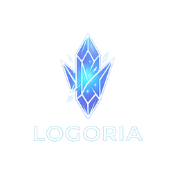

<div align="center">



# Logoria

**A collection log, farming planner and Manipulator assistant for Eureka Logos Actions.**

</div>

<!--
SCREENSHOT SLOT 1 (hero): the main window on the Dex page, a few rows Obtained and
at least one READY, taken with the Manipulator open so the "mneme stock live" pill
is green. Save as docs/images/dex.png and uncomment:


Before capturing anything: turn on Settings > Main Window > "Hide my character
name", and take the shots from a RELEASE build so the nav rail matches what
players get (no Diagnostics entry).
-->

Eureka has 56 Logos Actions and the game gives you almost no help tracking them.
Logoria fills that gap: it knows which ones you have registered, which ones you
could synthesise right now with the mnemes in your bag, and where to farm what you
are missing.

---

## Contents

- [Install](#install)
- [Start here](#start-here-thirty-seconds)
- [The Dex](#the-dex)
- [Collection Log](#collection-log)
- [Farming Plan](#farming-plan)
- [Floating Tracker](#floating-tracker)
- [At the Logos Manipulator](#at-the-logos-manipulator)
- [Commands](#commands)
- [Appearance and performance](#appearance-and-performance)
- [Troubleshooting](#troubleshooting)
- [What Logoria will not do](#what-logoria-will-not-do)
- [Where the data comes from](#where-the-data-comes-from)

---

## Install

> **Not released yet.** The repository URL below goes live with the first tagged
> release. Until then the source builds, but there is nothing to install from.

Logoria is a third-party plugin, so it installs from a custom repository.

1. In game, type `/xlsettings` and open the **Experimental** tab.
2. Paste this into **Custom Plugin Repositories** and press the **+** button:

   ```
   https://raw.githubusercontent.com/BoujeeBecky/Logoria/main/pluginmaster.json
   ```

3. Press **Save and Close**.
4. Open `/xlplugins`, search for **Logoria**, and install.

Then type `/logoria`.

---

## Start here (thirty seconds)

**Speak to Drake.** He stands beside the Logos Manipulator in Port Surgate. Open
your **Logos Action Log** from his menu.

That is it. Logoria reads the log the moment it opens and fills in your entire dex
at once, with no ticking boxes and no materials spent.

> The game already keeps this record, which is how armour augmentation knows you
> have registered all 56. Logoria just reads it.

After that everything is automatic:

- Slotting a Logos Action records it permanently, even after you unslot it.
- Standing at the Manipulator reads your live mneme stock, so the dex can tell you
  what you can make **right now**.
- Everything is stored per character. A dex that looks empty belongs to a
  different character, and Logoria says so on screen rather than leaving you
  guessing.

---

## The Dex

One row per Logos Action: icon, the jobs that can use it, what it does, and a
recipe.

### The three states

| State | Meaning |
| --- | --- |
| **Obtained** | Registered. You have made this one before. |
| **READY** | You are holding the mnemes for it but have **never registered it**. These rows are tinted, because this is the whole point. |
| **Unknown** | Not registered, and you are short of at least one mneme for every combination. |

Click a status dot to set or clear it by hand, for the rare case where the
automatic sources disagree with reality.

### Recipes

The recipe column shows the combination you can **actually make**. If you cannot
make any of them, it shows the cheapest instead, so you know what to go farm.
Counts read `have / needed` and turn green when you have enough.

Fewer mnemes means a higher success rate. Where an action has several
combinations, hover the recipe to see all of them.

### Filters

Search matches names and effect text. The radio buttons narrow to one state, and
**Only what I can make now** hides everything you are short of.

---

## Collection Log

<!--
SCREENSHOT SLOT 2: the Collection Log page, "Dim the ones you have not made" on,
so the contrast between owned and unowned is obvious.
Save as docs/images/collection-log.png and uncomment:


-->

The same 56 actions as a grid of icons, in the game's own log order. The fastest
way to see how far along you are.

- Registered entries are lit, the rest dimmed.
- **Left click** adds to your farm list.
- **Right click** toggles registered.
- Hover anything for its name, jobs, effect and recipe.

Log numbers match Drake's log, so you can compare the two side by side.

---

## Farming Plan

<!--
SCREENSHOT SLOT 3: the Farming Plan with two or three actions on the list, so the
shopping list on the right shows grouped logograms and at least one Map button.
Save as docs/images/farming.png and uncomment:


-->

Press **Farm** on any dex row to add that action. The plan totals the mnemes
across everything on your list and groups them by the logogram that yields them,
so one trip covers several actions.

Each group shows:

1. The logogram, and how many of its mnemes you are still short.
2. The mnemes themselves, with `have / needed` counts.
3. How that logogram drops, and which enemies drop it.
4. **Where to farm**, with a **Map** button per location that drops a marker and
   opens the zone.

> **Add everything I can almost make** is a quick start. It adds every
> unregistered action that is a single mneme away.

### About the coordinates

They are community-sourced from the FFXIV wikis, so they **should** be accurate
rather than **are** accurate. Two things are marked rather than hidden:

- Entries tagged `~` are approximate. Hover the mark and it tells you why that
  particular one is uncertain, usually because the wiki has no location table and
  what is pinned is the triggering FATE instead.
- Several of these enemies spawn in more than one place, which is why a logogram
  can list several rows. Take the nearest.

**Sprites work differently.** Eureka's adaptation mechanic levels a sprite up *in
place*. There is no separate higher-level sprite elsewhere on the map; it is the
same spawn under different weather. Go to the listed spot and wait.

---

## Floating Tracker

A small pinnable overlay showing what you are working toward, meant to sit on
screen while you farm.

- Adding anything to your farm list opens it automatically.
- Click an entry to expand its materials and where they come from.
- **Left click** adds to the farm list, **right click** toggles registered, the
  same as the collection log.

Settings can lock it in place, hide entries you already own, and set how
transparent it is. Locking removes the title bar as well as the ability to drag,
so position it first.

---

## At the Logos Manipulator

Stand at the Manipulator and Logoria reads your mneme stock live from the window.
The pill on the dex page tells you whether the stock you are looking at is live or
remembered from last time.

### The Fill button

**Fill** clears the Astral Array and loads a combination into it, so you do not
have to place each mneme by hand. It is only enabled while the Manipulator is open
and you hold the mnemes for at least one combination.

> ### Fill never synthesises
>
> It loads the array and stops. It does not press **Extract Mneme** for you. That
> last click is always yours, which means Logoria cannot consume your materials by
> accident or by bug.

Settings can open Logoria automatically whenever the Manipulator opens.

---

## Commands

| Command | Opens |
| --- | --- |
| `/logoria` | The main window: dex, collection log, farming plan, settings |
| `/logofarm` | The farming plan on its own |
| `/logolog` | The visual collection log on its own |
| `/logofloat` | Toggles the floating tracker overlay |
| `/logohelp` | The in-game help and about pages |

Every page in the main window is also its own window, so you can pull just the
farming plan out and leave the rest closed.

---

## Appearance and performance

Ten themes, applied live: **Aetherial**, **Banana**, **Boujee**, **Classic**,
**Crimson Court**, **Emerald Casino**, **Graphite**, **Ice**, **Opulent** and
**Synthwave**.

Semantic colours never change with the theme. Green still means you have enough
and red still means you do not, in all ten.

Individual controls for panel gradient, edge bevel, shine, film grain, animation
speed and domed shading, each of which dials to zero on its own.

### Vanilla mode

<!--
SCREENSHOT SLOT 4 (optional but nice): the same page side by side, themed vs
vanilla. Save as docs/images/vanilla.png.
-->

**Settings → Appearance → Vanilla mode** strips all of it and draws plain ImGui:
no gradients, no shadows, no grain, no animation. It removes hundreds of draw
calls a frame.

It is **off by default**. It exists for anyone who would rather spend the frames
on the game.

---

## Troubleshooting

**My dex is empty.**
It is per character. If another character has entries, the dex page says so rather
than leaving you guessing. Otherwise open Drake's Logos Action Log and it fills in
at once.

**Mneme counts look wrong or show zero.**
Stock can only be read from the Manipulator's own window, so it is live while you
are standing there and remembered otherwise. The pill on the dex page tells you
which you are looking at.

**The Fill button is greyed out.**
It needs the Manipulator open and enough mnemes for at least one combination.

**A column is squashed to nothing.**
Column widths are remembered once you drag them. **Settings → Layout → Reset table
column widths** starts them over.

**Something broke after a game patch.**
Please open an issue. The tooling that identifies a renamed window or a moved data
array lives in the development build, so a fix arrives as a plugin update.

---

## What Logoria will not do

- **No network access of any kind.** Nothing is uploaded, and there is nothing to
  upload it with.
- **Never sends chat**, never moves your character, never presses a game button
  you did not press.
- **Never synthesises and never consumes a material.**
- **Watches only the four Eureka windows it needs**, and only while one is open.

### Verify that yourself

Those are checkable claims, not promises. The released build is compiled without
the development tooling, and you can confirm both properties on the DLL inside the
release zip:

```
dotnet run --project Tools\VerifyRelease -- <path-to>\Logoria.dll
```

It reads assembly metadata only and never executes plugin code. It asserts that
the capture and probe types are absent, and that `System.Net.Http`,
`System.Net.Sockets` and `System.Net.Primitives` are **not referenced**. That last
part is the strong one: a .NET assembly cannot open a socket without referencing
something that can, whatever its source code claims.

---

## Where the data comes from

| Data | Source |
| --- | --- |
| Names, icons, descriptions, job restrictions | The game's own files, so they stay correct across patches |
| Your registered actions | The game: Drake's log, and what you have slotted |
| Recipes | The public tables at [ffxiv-eureka.com](https://ffxiv-eureka.com/logograms) |
| Farming locations | The community FFXIV wikis, marked with a confidence |

---

## Building from source

Clone and build. Nothing else is needed.

```
git clone https://github.com/BoujeeBecky/Logoria.git
cd Logoria
dotnet build -c Release
```

The output plugin is `bin\Release\Logoria\latest.zip`.

The shared UI kit this uses is vendored into `UiKit\` rather than referenced, so
there is no second repository to fetch. See `UiKit\README.md` for how that copy is
kept in step with its authoring version.

**Debug and Release are not the same build.** Debug additionally compiles the
development diagnostics tooling; Release does not contain it at all. Release is
what ships.

---

<div align="center">

Made for the Baldesion Arsenal crowd, by Boujee Becky.

Released under the [MIT licence](LICENSE).

</div>
